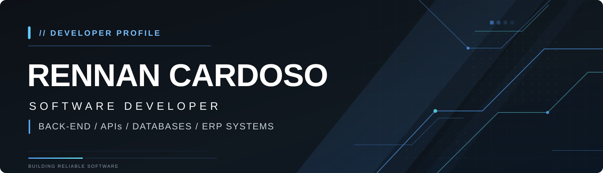

  

 

  <picture>
    <source
      media="(prefers-color-scheme: dark)"
      srcset="https://readme-typing-svg.demolab.com/?font=Poppins&weight=600&size=28&duration=3000&pause=1000&color=FFFFFF&center=true&vCenter=true&width=850&lines=Desenvolvedor+de+Software;Estudante+de+Engenharia+de+Software;Back-End+%7C+APIs+%7C+Banco+de+Dados;Construindo+solu%C3%A7%C3%B5es+e+evoluindo+todos+os+dias"
    />
    <source
      media="(prefers-color-scheme: light)"
      srcset="https://readme-typing-svg.demolab.com/?font=Poppins&weight=600&size=28&duration=3000&pause=1000&color=000000&center=true&vCenter=true&width=850&lines=Desenvolvedor+de+Software;Estudante+de+Engenharia+de+Software;Back-End+%7C+APIs+%7C+Banco+de+Dados;Construindo+solu%C3%A7%C3%B5es+e+evoluindo+todos+os+dias"
    />
    
  </picture>

  

  

  

 

##  Sobre mim

-  Desenvolvedor de Software Trainee na **WLE Soluções em Software**
-  Estudante de **Engenharia de Software**
-  Foco em desenvolvimento **Back-End, APIs e bancos de dados**
-  Interesse em **arquitetura, organização e qualidade de software**
-  Experiência com **desenvolvimento e manutenção de sistemas empresariais**
-  Formação prevista para **2027**

 

## 🚀 Tecnologias

### Linguagens

  
  
  
  
  

### Back-End e APIs

  
  
  

### Front-End

  
  
  

### Banco de Dados

  

### Ferramentas e DevOps

  
  
  
  

 

<h2 align="center">📈 GitHub Performance</h2>

  

 

<h2 align="center">⚡ Coding Consistency</h2>

  

 

  

